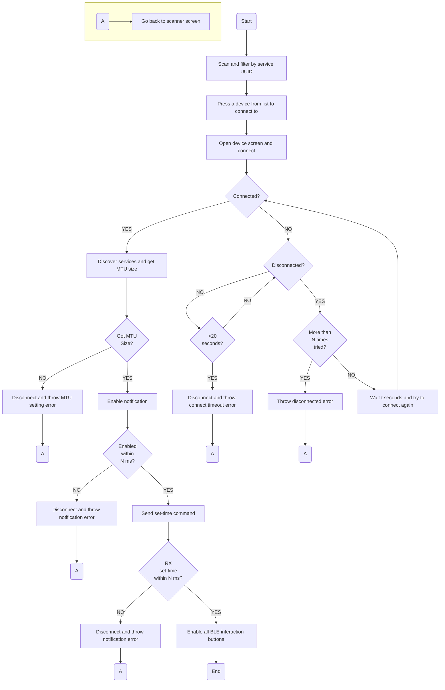

```mermaid

flowchart TD
    START(Start) --> B[Scan and filter by service UUID]
    B --> C[Press a device from list to connect to]
    C --> D[Open device screen and connect]
    D --> E{Connected?}
    E --YES--> F[Discover services and get MTU size]
    F --> G{Got MTU<br />Size?}
    G --NO--> DIS1[Disconnect and throw MTU setting error]
    G --YES--> J[Enable notification]
    DIS1 --> BACK1(A)
    J --> K{Enabled<br />within<br />N ms?}
    K --NO--> DIS2[Disconnect and throw notification error]
    K --YES--> M[Send set-time command]
    DIS2 --> BACK2(A)
    M --> N{RX<br />set-time<br />within N ms?}
    N --NO--> DIS3[Disconnect and throw notification error]
    DIS3 --> BACK3(A)
    N --YES--> O[Enable all BLE interaction buttons]
    O --> END(End)
    E --NO--> Q{Disconnected?}
    Q --NO--> R{>20<br />seconds?}
    Q --YES--> S{More than<br />N times<br />tried?}
    R --NO--> Q
    R --YES--> DIS4[Disconnect and throw connect timeout error]
    DIS4 --> BACK4(A)
    S --YES--> DIS5[Throw disconnected error]
    S --NO--> T[Wait t seconds and try to connect again]
    T --> E
    DIS5 --> BACK5(A)
    
    subgraph  
    SCANNER1(A) --> SCANNER2[Go back to scanner screen]
    end

```
